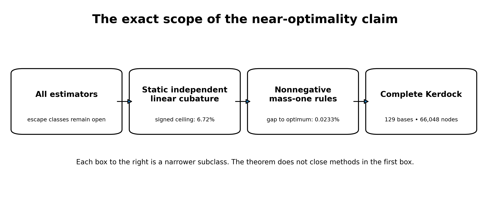
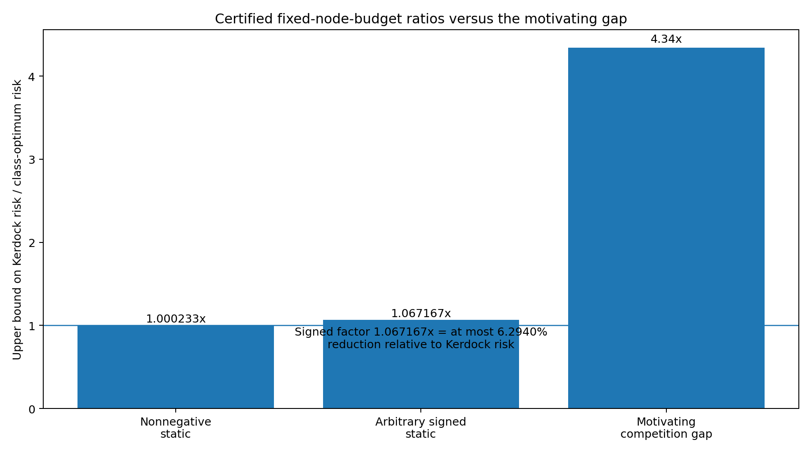
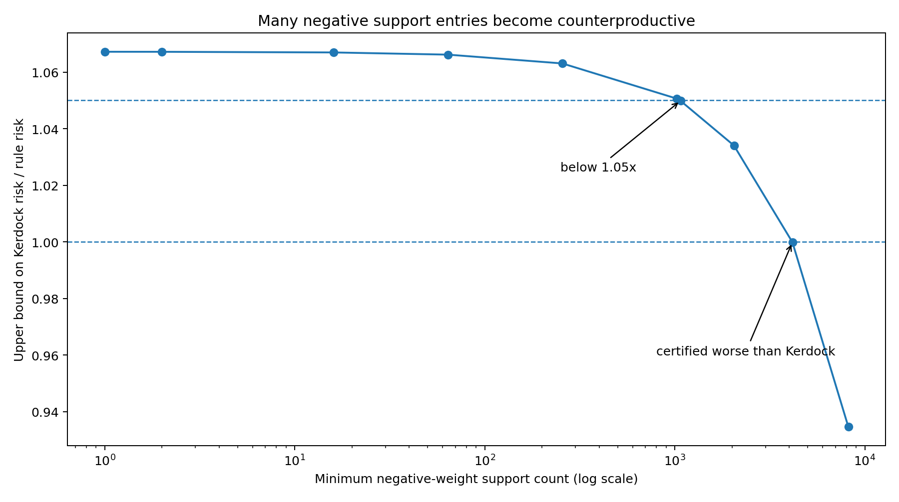
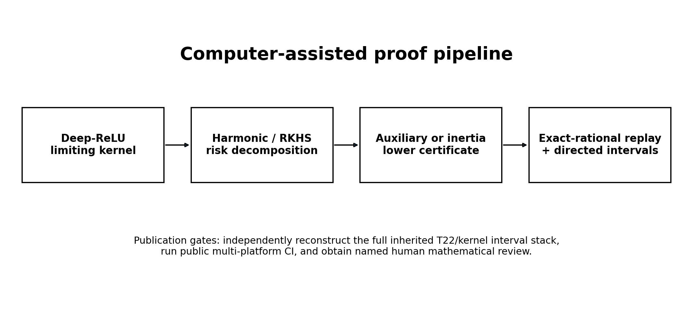

# Verification status and claim boundary

This manuscript is a theorem-first external-review draft. Its central phrase, **essentially optimal**, has a deliberately narrow meaning:

> At the target node budget, complete Kerdock is within 0.0233242% of the infimum for nonnegative static rules, while every signed mass-one static rule retains at least 93.7060168% of Kerdock risk, for the dimension-256, depth-32 limiting ReLU kernel.

Two nested classes are certified:

1. **Nonnegative mass-one rules:** Kerdock is within 0.0233242% of the infimum.
2. **Arbitrary signed static rules:** the audited frozen witness retains at least 93.7060168% of Kerdock risk. This permits a Kerdock-to-optimum factor of at most 1.067168, or at most a 6.2940% reduction in Kerdock risk. The theorem fixes node count, not implementation cost.

The result does **not** state that Kerdock is globally optimal for the finite-width benchmark, nor that an algorithm using the realized network weights, adaptive observations, nonlinear aggregation, or a transformed analytic residual cannot do better.

The numerical claims combine exact rational algebra with directed interval bounds. The all-degree degree-five witness has a reproducible script and certificate in the public release. The degree-280 comparison witness and the conservative inertia strengthening have exact-rational replay. The stronger reoptimized T70 witness was not recovered, so its marginally better constant is excluded from the audited headline. All signed bounds still depend on kernel-coefficient interval endpoints inherited from an earlier proof bundle. An independent Arb/FLINT/MPFR reconstruction of that interval stack remains a publication gate.

{width=90%}

# 1. Introduction

A deep homogeneous ReLU network under Gaussian input defines a high-dimensional integration problem with substantial algebraic structure. If the network weights are known, one may ask whether a carefully chosen deterministic design can estimate the expected activation more accurately than ordinary random sampling at the same number of full network evaluations.

The construction studied here uses a complete system of real mutually unbiased bases related to Kerdock codes. In dimension 256, 129 bases are available: 128 Kerdock/Walsh-Hadamard chirp bases together with the coordinate basis. Evaluating each basis vector and its antipode gives

\[
128\cdot256\cdot2+256\cdot2=66{,}048
\]

spherical nodes. The design is highly redundant from the viewpoint of ordinary Monte Carlo, but that redundancy is exactly what supplies cancellation. Complete orthonormal bases integrate low-order angular structure uniformly; mutual unbiasedness distributes the remaining pairwise geometry over a small number of inner products. Kerdock codes, orthogonal spreads, and mutually unbiased bases have long-standing connections to extremal Euclidean line sets and design theory [@calderbank1997; @boykin2005; @can2020].

The central question is not whether some oracle correction can improve Kerdock. Many can. The question is whether **another static linear rule at the same budget** can materially improve the average integration error for the relevant deep-ReLU ensemble. This is the class that Kerdock directly solves: select a fixed collection of nodes, assign fixed linear weights independent of the realized network, evaluate the integrand, and average.

The answer is unusually sharp. Within the nonnegative probability-rule class, a Delsarte-type computer-assisted certificate places Kerdock within roughly 2.33 parts in ten thousand of the optimum. Allowing arbitrary signed weights expands the class dramatically, but an inertia argument still proves that the optimum retains at least 93.706% of Kerdock risk at the same node budget. The second number is weaker, but it matters conceptually: negative weights do not create an unseen order-of-magnitude opportunity inside this static model. It is a node-budget theorem, not a wall-time theorem. The sign-count certificate further shows that a Kerdock-to-rule factor above 1.05 requires fewer than 1,072 negative-weight support entries after duplicate locations are consolidated and zero weights are removed; separately, equality in the older abstract block-trace floor would require an unrealizable atomic zero code.

## 1.1 Contributions

The paper makes six contributions.

**A two-tier static near-optimality theorem.** For the limiting depth-32 ReLU kernel on \(S^{255}\), at a budget of 66,048 points:

- every nonnegative mass-one static rule has risk at least the certified auxiliary optimum, and Kerdock is at most 1.00023324173 times that optimum;
- every arbitrary-real-weight mass-one static rule has risk at least 0.93706016837 of Kerdock's risk under the fully replayable frozen witness.

**A completed all-degree auxiliary optimization.** The optimal admissible lower minorant is a unique degree-five polynomial. It is the Hermite interpolant of the deep-ReLU kernel at three algebraic contact points. Exact Gaussian quadrature and strict negative reduced costs eliminate every higher Gegenbauer degree.

**An atomic inertia strengthening for signed rules.** A signed atomic moment matrix cannot have more positive eigenvalues than the rule has positive weights. Combining this positive-index limit with trace constraints strictly improves the prior abstract block-trace certificate.

**A negative-weight support-count frontier.** After duplicate locations are consolidated and zero weights removed, conditioning on the number of negative-weight support entries yields a replayable hierarchy from the same frozen witness: at least 1,072 such entries rule out a 1.05-fold Kerdock-to-rule factor, while at least 4,160 make the rule provably worse than Kerdock. This count does not bound the magnitude of total negative mass. The earlier arbitrary-total-mass corollary is not part of the audited core because its standalone witness was not recovered.

**A proof-method boundary.** The rank plus individual harmonic block-trace relaxation is exactly sharp even if all comparison profiles share one common abstract Gram matrix. Any stronger theorem must use point-evaluation realizability, not more second-moment bookkeeping.

**An equality and nonattainment theory for the older abstract floor.** Equality in the rank/block-trace relaxation forces equal positive weights and a spherical zero-code condition. Two active certificate profiles require common zeros of consecutive Gegenbauer polynomials, which is impossible. Thus that older abstract floor is strictly unattainable, although unrestricted signed total variation prevents turning strictness alone into a uniform numerical increment without additional conditioning.

{width=82%}

## 1.2 Why the problem becomes spherical

Let \(X\sim\mathcal N(0,I_d)\), and let \(f:\mathbb R^d\to\mathbb R^m\) be positively homogeneous of degree one:

\[
f(rx)=r f(x),\qquad r\ge0.
\]

Write \(X=RU\), where \(U\) is uniform on \(S^{d-1}\) and \(R=\|X\|_2\) is independent. Then

\[
\mathbb E[f(X)]=\mathbb E[R]\,\mathbb E[f(U)].
\]

Bias-free ReLU networks are positively homogeneous, so radial integration is analytic and the hard part is angular. This reduction is exact, not an approximation. It makes spherical design theory and zonal kernels the natural language.

## 1.3 Related work

Spherical designs originated as configurations that integrate low-degree polynomials exactly [@delsarte1977]. Schoenberg's characterization of positive-definite zonal kernels provides the nonnegative harmonic expansion used in RKHS worst-case-error arguments [@schoenberg1942; @wendland2005]. The Delsarte linear-programming method and its descendants use auxiliary positive-definite functions to certify energy or code bounds; the distinction between an optimized auxiliary program and an attained point configuration is central here [@delsarte1977; @cohn2007]. Recent work gives potential-independent linear-programming energy bounds for weighted spherical codes and designs [@borodachov2024weighted]. That framework is especially close to the nonnegative part of this paper. Our contribution is a potential-specific, budget-specific certificate for the depth-32 ReLU kernel, together with exact completion of its all-degree auxiliary program and a separate signed-weight analysis.

Kerdock codes connect finite-field and \(\mathbb Z_4\) coding theory to extremal real and complex line sets [@calderbank1997]. Real mutually unbiased bases have at most \(d/2+1\) members, and dimensions of the appropriate power-of-two form admit maximal constructions [@boykin2005]. The present 129-basis design in \(d=256\) is exactly such a maximal real-MUB configuration. Recent exact semidefinite-programming work proves packing optimality for the same cardinality family of antipodal Kerdock/MUB arrangements, including the 66,048-point configuration in dimension 256 [@cohn2024sdp]. That work optimizes a separation/cardinality objective. The theorem here instead bounds a depth-32 ReLU-kernel energy, equivalently an RKHS cubature discrepancy, at an antipodal evaluation budget; neither result subsumes the other. Association schemes linking Kerdock codes, maximal real MUBs, and candidate universally optimal configurations provide further structural context [@abdukhalikov2009].

Infinite-width random neural networks induce compositional Gaussian-process or conjugate kernels [@cho2009; @daniely2016; @lee2018; @matthews2018]. Our kernel is one particular depth-32 normalized ReLU recursion. The contribution is not a new neural-kernel limit; it is a budget-specific quadrature boundary for that kernel.

Kernel quadrature and probabilistic integration typically study convergence rates, node optimization, or posterior uncertainty [@briol2019; @kanagawa2018]. Here the unusual object is a highly structured finite design with a fixed industrial-scale node budget, together with a computer-assisted constant-factor boundary rather than an asymptotic rate.

# 2. Problem formulation

## 2.1 The deep-ReLU limiting kernel

Let

\[
K_0(t)=t,
\qquad
K_{\ell+1}(t)=\kappa(K_\ell(t)),
\]

where the normalized ReLU covariance map is

\[
\kappa(t)=\frac{\sqrt{1-t^2}+(\pi-\arccos t)t}{\pi}.
\]

We consider \(K_{32}\) on \(S^{255}\). It is a continuous positive-definite zonal kernel and admits a normalized Gegenbauer expansion

\[
K_{32}(t)=\sum_{\ell\ge0}a_\ell G_\ell(t),
\qquad a_\ell\ge0,
\qquad G_\ell(1)=1.
\]

The nonnegative coefficients are the harmonic-energy weights of the limiting random field.

## 2.2 Static linear cubature and ensemble risk

Let \(P\) denote normalized spherical measure. A static linear rule is

\[
Qf=\sum_{i=1}^m w_i f(x_i),
\qquad x_i\in S^{255},
\qquad m\le N=66{,}048.
\]

The nodes and weights are selected independently of the realized random field. In the probability-rule class, \(w_i\ge0\) and \(\sum_iw_i=1\). The signed class permits arbitrary real weights, initially retaining the mass-one constraint.

For a centered rotationally invariant random field with covariance \(K(x\cdot y)\), the ensemble mean-squared integration error is

\[
R_K(Q)
=
\mathbb E\left[\left(\int f\,dP-Qf\right)^2\right]
=
\iint K(x\cdot y)\,d(P-Q)(x)d(P-Q)(y).
\]

This is the squared RKHS discrepancy of \(P-Q\). The equality applies because the rule is independent of the field realization. If the algorithm chooses nodes after reading the network or pilot values, the joint distribution changes and this static risk comparison no longer applies without a conditional argument.

## 2.3 The complete Kerdock rule

Let \(Q_K\) be the uniform rule on the 66,048 antipodal vectors from 129 real mutually unbiased bases. Each basis is orthonormal. Vectors from distinct bases have absolute inner product \(1/16\). The coordinate basis contributes 512 antipodal points; the 128 chirp bases contribute 65,536.

Because each basis is complete and antipodal, many low-degree harmonic components cancel exactly. The rule's risk can be reduced to a small set of kernel evaluations at the design's association inner products. The public code audit reconstructs this node generation and checks the packaged chirp signs and mutual-unbiasedness geometry; the exact final benchmark package is a separate reproducibility issue and is not required for the limiting-kernel theorem.

## 2.4 Scope matrix

The results divide into six clearly separated classes.

- **Nonnegative near-optimality:** infinite-width \(K_{32}\); any \(m\le66{,}048\); nonnegative mass-one weights; no network dependence; computer-assisted.
- **Signed floor:** infinite-width \(K_{32}\); any \(m\le66{,}048\); arbitrary real mass-one weights; no network dependence; computer-assisted.
- **Arbitrary-total-mass signed rules:** not part of the audited headline; an earlier corollary was reported, but its standalone witness was not recovered.
- **Fixed Kerdock-line allocation:** limiting or fixed-support variants on the MUB universe; arbitrary real weights; exact under the stated model.
- **Actual finite-width arbitrary-node rules:** width 256; static but otherwise unrestricted; open.
- **Adaptive or nonlinear estimators:** may use weights or pilot observations; open.

# 3. Nonnegative static rules: Kerdock within 0.0233242%

## 3.1 Delsarte-type auxiliary lower bounds

Let

\[
h(t)=\sum_{\ell=0}^L c_\ell G_\ell(t),
\qquad c_\ell\ge0\; (\ell\ge1),
\qquad h(t)\le K_{32}(t).
\]

For a nonnegative mass-one rule, positive definiteness implies

\[
\sum_{i,j}w_iw_jG_\ell(x_i\cdot x_j)\ge0
\qquad (\ell\ge1).
\]

Using \(\sum_iw_i^2\ge1/N\), one obtains the certified energy lower bound

\[
E_K(Q)
\ge
c_0+\frac{K_{32}(1)-h(1)}{N}.
\]

Subtracting the exact kernel mean converts the energy bound into an MSE bound. The problem is therefore to maximize

\[
\Phi(h)=c_0+\frac{K_{32}(1)-h(1)}{N}
\]

subject to the pointwise minorant and nonnegative Gegenbauer coefficients.

## 3.2 The one-sided near-optimality theorem

**Theorem 1 (nonnegative static near-optimality).** For \(d=256\), depth 32, and \(N=66{,}048\), every static, network-independent linear rule with at most \(N\) arbitrary spherical nodes, nonnegative weights, and total mass one satisfies

\[
R_{K_{32}}(Q)
\ge
2.4330928587565938\times10^{-7}.
\]

The certified Kerdock-risk interval implies

\[
1
\le
\frac{R_{K_{32}}(Q_K)}{\inf_Q R_{K_{32}}(Q)}
\le
1.0002332417295004.
\]

Thus Kerdock's relative excess over the unknown optimum is at most

\[
\boxed{0.023324172950039\%}.
\]

The lower endpoint is zero: the theorem does not prove that a better rule exists.

The result also holds for randomized rules whose randomization is independent of the realized field, after averaging over the rule randomness.

## 3.3 Unique degree-five optimizer of the all-degree auxiliary program

The optimized auxiliary function is not merely a good degree-five candidate. The complete admissible program has a unique degree-five optimizer.

Let \(t_1,t_2,t_3\) be the roots of

\[
22102t^3+21930t^2-87t-85=0.
\]

Let \(h_{\star}\) be the unique degree-five polynomial satisfying

\[
h_{\star}(t_j)=K_{32}(t_j),
\qquad
h_{\star}'(t_j)=K_{32}'(t_j),
\qquad j=1,2,3.
\]

**Theorem 2 (all-degree auxiliary optimum).** The polynomial \(h_{\star}\) is feasible, its five nonconstant normalized-Gegenbauer coefficients are strictly positive, every reduced cost for degree \(\ell\ge6\) is strictly negative, and \(h_{\star}\) uniquely maximizes \(\Phi\) over finite admissible expansions and the stated absolutely convergent nonnegative expansions.

### Proof architecture

The proof has four load-bearing components.

1. **Exact dual Gaussian quadrature.** The auxiliary objective defines a linear functional whose first six monomial moments are rational. Its monic degree-three orthogonal polynomial is the cubic above. Exact root intervals and Lagrange formulas yield three positive quadrature weights, exact through degree five.

2. **All higher reduced costs are negative.** Degrees 6 through 14,658 are checked using exact integer recurrence. A normalized Gegenbauer tail bound proves strict negativity for every larger degree. An independent C++ exact-integer audit reproduces the finite sweep.

3. **The Hermite interpolant is a global minorant.** A computer-assisted derivative argument establishes

\[
K_{32}^{(6)}(t)>0,
\qquad -1<t<1.
\]

The generalized Hermite remainder gives the displayed nonnegative difference on the open interval. A separate directed endpoint certificate proves strict positive margins at both `t=1` and `t=-1`; continuity alone would not justify the manuscript's stronger equality-only-at-contacts statement.

\[
K_{32}(t)-h_{\star}(t)
=
\frac{K_{32}^{(6)}(\xi_t)}{6!}
\prod_{j=1}^3(t-t_j)^2
\ge0.
\]

4. **Coefficient positivity and primal-dual equality.** A Krawczyk-style interval linear-system certificate places all five nonconstant Gegenbauer coefficients strictly above zero. Contact at the dual quadrature nodes makes the primal and dual objectives equal. Strict higher-degree reduced costs and the six contact/derivative conditions give uniqueness.

The theorem optimizes the lower-certificate program. It does not show that a point set attains that lower bound. The certified Kerdock ratio is one-sided because Kerdock is feasible and the true optimum could equal Kerdock.

# 4. Arbitrary signed weights: an inertia floor

The nonnegative theorem is much sharper numerically, but it leaves a natural loophole: signed weights can cancel low-order errors in ways unavailable to probability rules. The signed theorem closes winning-scale gains in that larger static class.

## 4.1 Harmonic moment matrices

For a comparison profile, let \(E\) be the node-evaluation matrix and \(W=\operatorname{diag}(w_i)\). The profile moment matrix is

\[
M=E^TWE.
\]

Let its target be a block-diagonal matrix \(A\), and write

\[
T=\operatorname{tr}(M)=\operatorname{tr}(A),
\qquad
S_2=\|A\|_F^2.
\]

The discrepancy simplifies to

\[
\|A-M\|_F^2=\|M\|_F^2-S_2,
\]

because the fixed block traces imply \(\langle A,M\rangle=S_2\).

## 4.2 Positive-index lemma

**Lemma 3.** Let \(M=M^T\) have trace \(T>0\) and at most \(p\) positive eigenvalues. Then

\[
\boxed{\|M\|_F^2\ge T^2/p.}
\]

**Proof.** Let \(\lambda_i^{\mathrm{pos}}\) be the positive eigenvalues. The nonpositive eigenvalues have nonpositive sum, hence \(\sum_i\lambda_i^{\mathrm{pos}}\ge T\). Cauchy-Schwarz yields

\[
\|M\|_F^2
\ge
\sum_i(\lambda_i^{\mathrm{pos}})^2
\ge
\frac{(\sum_i\lambda_i^{\mathrm{pos}})^2}{p}
\ge
\frac{T^2}{p}.
\]

The point is that a negative eigenvalue cannot cheaply carry positive trace; it only adds Frobenius cost.

## 4.3 Atomic inertia transfer

By Sylvester inertia monotonicity under congruence, the number of positive eigenvalues of \(E^TWE\) is at most the number of positive entries of \(W\). If a mass-one rule has at least one negative weight, it has at most \(N-1\) positive weights. Therefore

\[
\|A-M\|_F^2
\ge
\frac{T^2}{N-1}-S_2.
\]

Compared with the older abstract rank floor \(T^2/N-S_2\), the exact atomic increment is

\[
\frac{T^2}{N(N-1)}.
\]

Rules with fewer than \(N\) active positive nodes also fall into this strengthened branch. Rules with exactly \(N\) positive weights are governed by the much stronger nonnegative theorem in Section 3.

## 4.4 Inertia-strengthened frozen degree-280 witness

The released degree-280 certificate contains a frozen family of 146 nonnegative comparison profiles that consumes the deep-ReLU kernel's Gegenbauer coefficients through degree 320. The original verifier exactly replays its rational coefficient allocation. For the audited headline, we keep that allocation fixed and replace each component's abstract rank floor by the stronger positive-index floor. Because the coefficient consumption is unchanged, multiplying each old contribution by the exact ratio of strengthened to original component floors gives another valid certificate. Every downstream operation is exact rational arithmetic. This is deliberately slightly weaker than the later reoptimized T70 result, whose 134-component rational allocation was not recovered.

**Theorem 4 (audited signed static floor).** Every static, network-independent, mass-one linear rule with at most 66,048 arbitrary spherical nodes and arbitrary real weights satisfies

\[
R_{K_{32}}(Q)
\ge
2.2804861843861462\times10^{-7}
\]

and therefore

\[
\boxed{
R_{K_{32}}(Q)
\ge
0.9370601683665084\,R_{K_{32}}(Q_K).
}
\]

Equivalently,

\[
\boxed{
\frac{R_{K_{32}}(Q_K)}{R_{K_{32}}(Q)}
\le
1.0671673322143325.
}
\]

The latter factor should not be described as a 6.7167% reduction. The corresponding maximum reduction relative to Kerdock risk is

\[
1-0.9370601683665084
=
6.29398316334916\%.
\]

The theorem fixes the number of spherical evaluations. It does not assert equal implementation cost for arbitrary weighting, node generation, or preprocessing.

The included verifier first replays the original degree-280/order-320 rational witness and then applies the exact positive-index replacement to its frozen allocation. Its proof-critical numerical dependency is the inherited directed lower endpoints for the depth-32 kernel coefficients. The unrecovered reoptimized T70 allocation reported the slightly stronger fraction `0.9370605225569535`; that number remains historical provenance rather than a public headline theorem.

# 5. Negative-weight support-count hierarchy

First consolidate duplicate locations and remove zero weights. The inertia argument strengthens when the resulting rule has many negative-weight support entries. If at least \(q\) remaining weights are negative, every profile moment matrix has at most \(N-q\) positive eigenvalues, so

\[
\|A-M\|_F^2
\ge
\frac{T^2}{N-q}-S_2.
\]

After duplicate locations are consolidated and zero weights removed, let `q` denote the number of negative-weight support entries. Applying the same frozen coefficient allocation with positive-index limits `N-q` produces the audited frontier below. Selected points are: `q=1`, factor cap 1.0671673; `q=1,072`, factor cap 1.0498338; `q=4,160`, factor cap 0.9998614; and `q=8,192`, factor cap 0.9346245. Reoptimization can only strengthen these figures, but is not needed for the thresholds stated here. These statements concern support count, not the magnitude of total negative mass.

{width=82%}

Three conclusions follow.

1. Any consolidated rule with at least 1,072 negative-weight support entries cannot achieve a 1.05-fold Kerdock-to-rule risk factor at this node budget.
2. Any consolidated rule with at least 4,160 negative-weight support entries is certified worse than Kerdock.
3. A rule capable of approaching the universal signed boundary must use relatively few negative-weight support entries after zero weights and duplicate locations are consolidated. The hierarchy alone does not lower-bound the magnitude of the negative mass.

This does not construct a good sparse-signed rule. It shows what any such rule would have to look like.

# 6. The abstract block-trace relaxation is exhausted

One might try to improve the signed theorem by coupling the 146 comparison profiles through a common harmonic second-moment matrix rather than optimizing their rank floors separately. That route is exactly sharp at the abstract matrix level.

## 6.1 Setup

Let the active harmonic space be

\[
\mathcal H=\bigoplus_{\ell\in\Lambda}H_\ell,
\qquad d_\ell=\dim H_\ell,
\]

and assume \(d_\ell\ge N\) for every active degree; here the smallest active dimension already exceeds 2.8 million. For a nonnegative profile \(a=(a_\ell)\), define

\[
D_a=\bigoplus_\ell\sqrt{a_\ell}I_{d_\ell},
\qquad
A_a=\bigoplus_\ell a_\ell I_{d_\ell}.
\]

Suppose every profile matrix is generated from one common symmetric \(B\) with

\[
\operatorname{rank}(B)\le N,
\qquad
\operatorname{tr}(B_{\ell\ell})=d_\ell,
\qquad
M_a=D_aBD_a.
\]

## 6.2 Simultaneous sharpness

**Theorem 6 (shared-Gram sharpness).** For any finite family of nonnegative profiles, one feasible positive-semidefinite rank-\(N\) matrix \(B\) simultaneously attains

\[
\|A_a-M_a\|_F^2
=
\frac{T_a^2}{N}-S_a
\]

for every profile.

**Construction.** Choose \(V_\ell\in\mathbb R^{d_\ell\times N}\) with \(V_\ell^TV_\ell=I_N\), set \(U_\ell=\sqrt{d_\ell/N}V_\ell\), stack the \(U_\ell\), and let \(B=UU^T\). For each profile, the column Gram of \(D_aU\) equals \((T_a/N)I_N\), so every nonzero eigenvalue of \(M_a\) is \(T_a/N\).

The constructed \(B\) need not arise from point evaluations on the sphere. It is a counterexample to a proof method, not a cubature construction. It proves that sharing rank, traces, and all cross-degree second-moment blocks is insufficient. A stronger proof must impose realizability identities such as harmonic product linearization, sphere-ideal localizers, commuting multiplication operators, or higher-order moment consistency.

# 7. Atomic equality, zero codes, and strict nonattainment

## 7.1 Equality characterization

For one profile, equality in the rank/block-trace bound forces:

- exactly \(N\) active nodes;
- all nonzero eigenvalues of the moment matrix equal;
- idempotence \(M^2=(T/N)M\);
- equal positive weights \(w_i=1/N\);
- zero off-diagonal feature-kernel inner products.

Equivalently, the nodes must form an \(N\)-point zero code for the comparison kernel. Signed cancellation cannot attain the abstract boundary: equality itself forces positivity and uniformity.

## 7.2 The released abstract floor is unattainable

The degree-280 certificate contains two positive components using adjacent degrees \((3,4)\) but different radial ratios \(r_1\ne r_2\):

\[
L_{3,r}(t)=d_3G_3(t)+r d_4G_4(t).
\]

If an atomic rule attained the full weighted certificate floor, it would attain equality for both components. Every off-diagonal inner product \(t_{ij}\) would satisfy

\[
L_{3,r_1}(t_{ij})=L_{3,r_2}(t_{ij})=0.
\]

Subtracting gives \(G_4(t_{ij})=0\), then \(G_3(t_{ij})=0\). Consecutive Gegenbauer polynomials have no common zero: their three-term recurrence would propagate a common zero down to \(G_0\equiv1\).

**Theorem 7 (strict atomic nonattainment).** No actual mass-one signed atomic rule with at most 66,048 nodes attains the older abstract degree-280 floor. Every actual rule has strictly larger risk.

The contradiction is redundant: the certificate contains many repeated adjacent-degree pairs. The degree-3/4 pair alone suffices.

## 7.3 Why strictness is not a uniform signed epsilon

The space of signed atomic rules is noncompact when total variation is unbounded. Coalescing positive and negative atoms can keep low-order moments bounded while weights diverge. A one-dimensional toy example is

\[
Q_\varepsilon
=
\left(1+\frac1\varepsilon\right)\delta_0
-
\frac1\varepsilon\delta_\varepsilon,
\]

whose total variation tends to infinity while its low-order moment matrix converges.

Therefore strict nonattainment does not automatically provide a uniform numerical gap over all signed rules. For every fixed total-variation bound \(B\), compactness does imply an existential \(\varepsilon(B)>0\), but the current proof does not give a useful explicit constant. Any quantitative strengthening must control total variation, negative mass, conditioning, or full spherical moment realizability.

# 8. What “essentially optimal” means

The phrase is justified by two quantitative statements with different normalizations:

\[
\frac{R(Q_K)}{\inf_{Q\in\mathcal C_+}R(Q)}
\le 1.00023324173,
\]

\[
\frac{R(Q_K)}{\inf_{Q\in\mathcal C_{\pm}}R(Q)}
\le 1.06716733222.
\]

For the signed class, the second ratio corresponds to at most a 6.2940% reduction relative to Kerdock risk, not 6.7167%.

For the nonnegative class Kerdock directly addresses—fixed nodes, fixed probability weights, and no runtime information beyond function values—the baseline is not merely good: the remaining relative-risk gap is below 0.024%. The larger signed class retains a quantified but nonzero margin of at most 6.294% in Kerdock-relative risk.

This does not make all further work pointless. It changes what further work must be. Material improvement must leave the static class by at least one of the following mechanisms:

- choose nodes or weights from the realized network;
- use nonlinear processing of the transcript;
- exploit finite-width structure absent from the limiting kernel;
- introduce an exactly integrable network-dependent anchor and recertify the residual;
- compute new analytic state information rather than only changing cubature geometry;
- use a structured signed rule whose lower evaluation cost compensates for limited risk improvement.

The theorem is thus both a near-optimality result and a search-space map.

# 9. Verification and open-source release

{width=90%}

## 9.1 Included proof artifacts

The accompanying repository includes:

- the canonical v5.2 one-sided nonnegative theorem record;
- the completed all-degree auxiliary theorem and its available Python certificate generator;
- the exact-rational all-degree certificate;
- the original signed comparison witness, its exact verifier, and the audited frozen-witness inertia verifier;
- the replayed frozen-witness sign-count hierarchy;
- the block-trace sharpness and equality proof;
- the shared-Gram realizability and strict-nonattainment report;
- the canonical workbook and claim manifest.

## 9.2 Evidence tiers

The mathematical release distinguishes:

- **exact theorem:** symbolic or finite-dimensional proof independent of floating arithmetic;
- **exact-rational replay:** a proposed numerical witness checked entirely by integer/rational operations;
- **directed interval certificate:** analytic quantity enclosed with one-sided rounding;
- **external replication pending:** a load-bearing interval stack has not yet been reconstructed by an independent implementation;
- **reported experiment:** a result described in the ledger but lacking the full raw artifact bundle.

The nonnegative and signed constants must retain an inherited-endpoint qualifier until the T22/kernel coefficient stack is independently regenerated. The T16 primal numerics now have a second `mpmath.iv` implementation, but that does not independently reconstruct the full T22 coefficient archive. The wording should not silently upgrade “replayed from inherited endpoints” into “independently reproduced.”

## 9.3 Suggested independent audit

A compact audit can proceed in four stages.

1. Recompute the depth-32 kernel and its Gegenbauer coefficient intervals using an independent high-precision stack.
2. Replay the nonnegative degree-five primal and dual certificates, including the corrected derivative route, coefficient positivity, and explicit endpoint separation.
3. Replay the original degree-280 signed witness, then the conservative frozen-witness inertia and sign-count verifier with exact rationals.
4. Check that every displayed comparison uses the same certified Kerdock risk endpoint and the exact scope \(d=256\), depth 32, \(N=66{,}048\).

The repository is intentionally permissive: readers are encouraged to improve the certificate, find a better static rule, or demonstrate a finite-width/adaptive escape.

# 10. Limitations

1. **Limiting kernel, not exact width 256.** The arbitrary-node theorems apply to the infinite-width depth-32 kernel. A finite-width coefficient moment-dual program exists, but the required architecture-specific intervals are not completed here.
2. **Static independence.** Nodes and weights cannot depend on the realized network or observed activation values.
3. **Linear aggregation.** Nonlinear use of complete-basis outputs lies outside the theorem. Even simple ridge functions can be integrated exactly from a basis using nonlinear norm reconstruction.
4. **One-sided nonnegative ratio.** The 0.0233242% figure is an upper bound on Kerdock's possible excess. The true excess could be zero.
5. **Signed gap remains nonzero.** The signed theorem permits up to a 6.2940% reduction in Kerdock risk. It does not construct a rule near the floor.
6. **Unbounded total variation.** Strict nonattainment does not yield a uniform improvement over the signed floor without another compactness or conditioning assumption.
7. **Computer-assisted trust base.** Rational replay is available, but independent interval reconstruction and named human mathematical review remain necessary before formal submission.
8. **Benchmark implementation separate.** The exact final 129-basis package tied to the reported exposed benchmark run is not currently in the release. That provenance gap affects empirical reproduction, not the limiting-kernel theorem.

# 11. Conclusion

Complete Kerdock cubature is essentially optimal for the nonnegative static deep-ReLU spherical-integration problem it was designed to solve. At 66,048 nodes, no nonnegative static rule can improve its limiting-kernel risk by more than approximately 0.0233242%. In the larger arbitrary-signed mass-one class, the audited frozen witness limits the possible reduction to approximately 6.2940%, and sufficiently many negative-weight entries are provably counterproductive. The rank-and-block-trace-only relaxation behind the older signed floor is exhausted; equality there would require an impossible atomic zero code. Stronger uniform bounds must use additional atomic realizability, sign, conditioning, or total-variation information.

The correct scientific interpretation is neither “Kerdock solves every white-box estimation problem” nor “only a few percent remain, so nothing else can work.” It is:

> At this node budget, nonnegative static optimization can improve Kerdock risk by at most 0.0233242%, and the audited arbitrary-signed class by at most 6.2940%. Any larger improvement must exploit finite-width structure, network dependence, nonlinear information, transformed residuals, lower evaluation cost, or a genuinely new analytic identity.

That boundary is the main theorem and the main practical value of the work.

# Appendix A. Certified constants

- **Dimension:** 256.
- **Depth:** 32.
- **Node budget:** 66,048.
- **Nonnegative Kerdock/infimum ratio upper bound:** 1.0002332417295004.
- **Nonnegative relative excess upper bound:** 0.023324172950039%.
- **Audited signed risk floor / Kerdock upper endpoint:** 0.9370601683665084.
- **Audited Kerdock-to-signed-optimum factor cap:** 1.0671673322143325-fold.
- **Equivalent maximum reduction in Kerdock risk:** 6.29398316334916%.
- **Stronger reported reoptimized fraction, excluded from headline:** 0.9370605225569535 (witness not recovered).
- **Negative atoms ruling out a 1.05-fold gain:** 1,072.
- **Negative atoms making the rule worse than Kerdock:** 4,160.

# Appendix B. Claim language

**Safe:** “Complete Kerdock is certified within 0.0233242% of optimal among static, network-independent, nonnegative mass-one rules with at most 66,048 nodes for the dimension-256 depth-32 limiting ReLU kernel.”

**Safe:** “Within the corresponding arbitrary-signed static class at the same node budget, the audited Kerdock-to-optimum risk factor is at most 1.067168, equivalent to at most a 6.2940% reduction in Kerdock risk.”

**Unsafe:** “Kerdock is globally optimal for WHestBench.”

**Unsafe:** “No finite-width or adaptive estimator can beat Kerdock.”

**Unsafe until external reconstruction:** “The complete T22/kernel interval stack has been independently reproduced.”

# References
