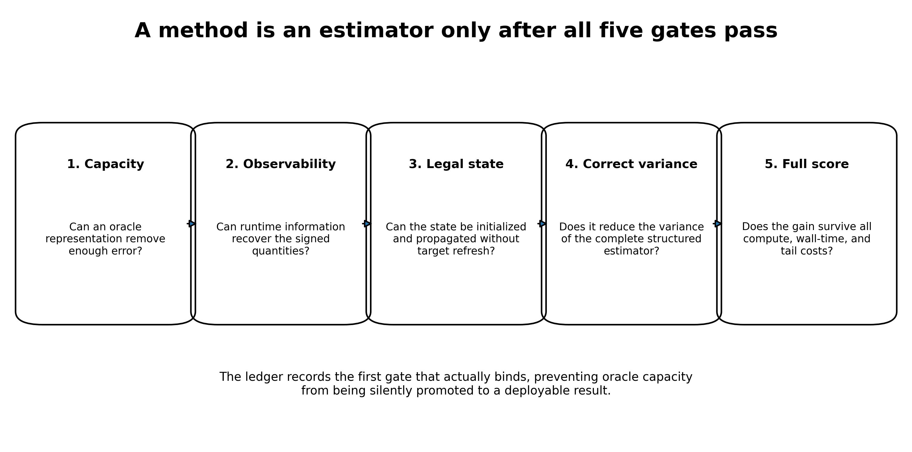
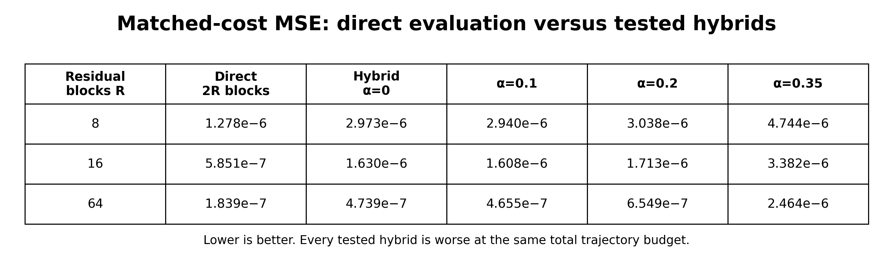
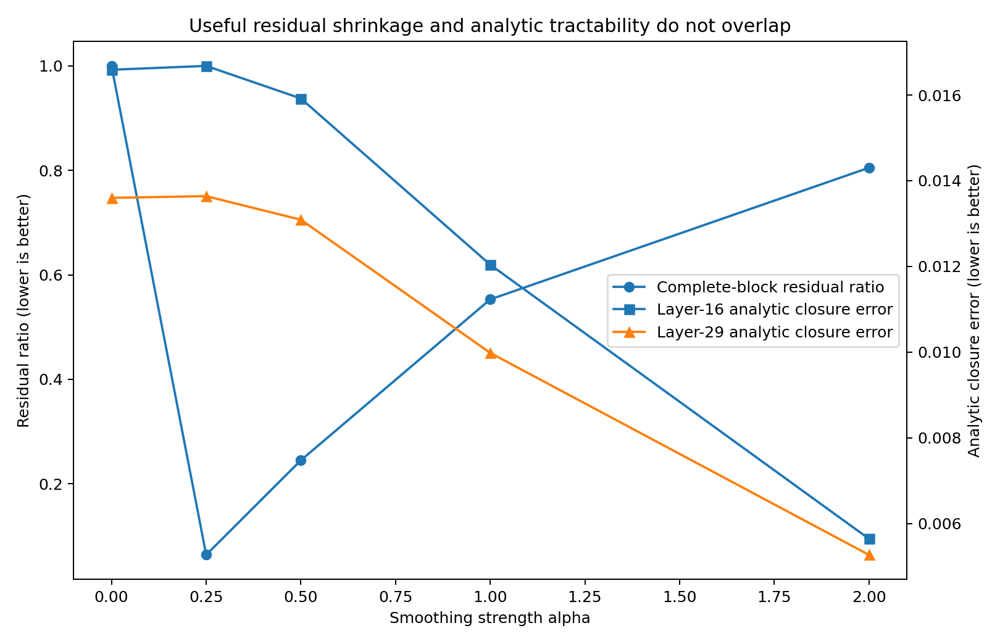
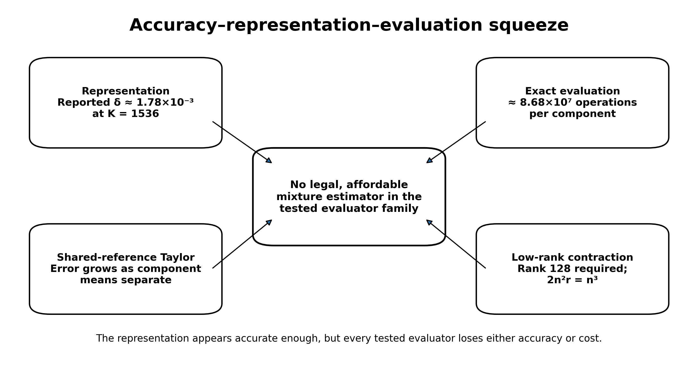
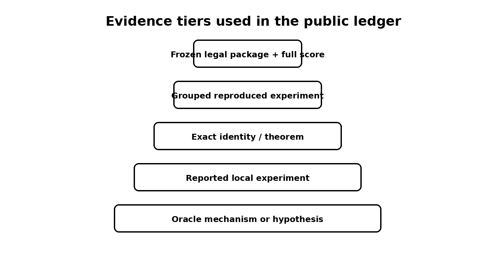

# Status and relationship to the theorem paper

This is the empirical and methodological companion to **Near-Optimality of Complete Kerdock Cubature for Static Deep-ReLU Gaussian Integration**. The theorem paper establishes a sub-0.024% gap for nonnegative static rules and a 6.2940% Kerdock-relative ceiling for arbitrary signed mass-one rules in the relevant limiting-kernel model. This paper asks what happened when the project tried to leave that class.

The result is not a new winning estimator. It is a structured account of why several apparently promising paths failed, which failures are theorem-level, which are empirical, and which remain open. The public release intentionally preserves the research ledger rather than presenting a cleaned narrative with every dead end removed.

{width=96%}

# 1. Introduction

A recurring failure mode in numerical machine learning is to confuse an accurate internal object with an executable estimator. The confusion is understandable. Research is usually decomposed into manageable pieces: fit a representation, predict a residual, approximate a covariance, compress a tensor, or estimate a control coefficient. Each piece may look successful in isolation. But an estimator is a conjunction:

1. it must contain enough information;
2. that information must be observable at runtime;
3. the state must be initialized and propagated without target leakage;
4. the measured error must match the actual structured estimator;
5. the full MSE-cost product must improve, including preprocessing, special functions, memory movement, and tails.

The WHestBench project made this conjunction unusually visible. The task was to estimate Gaussian activation means in deep homogeneous ReLU networks under a strict FLOP and wall-time budget. A deterministic complete-Kerdock estimator was already strong. Large oracle studies repeatedly found substantial correctable error. Yet no correction survived all five gates.

This paper develops three main case studies.

**Structured residual variance.** A control or analytic anchor is not judged by pointwise residual variance when the stochastic estimator samples complete Kerdock bases. The exact variance is the variance of complete-block residual means. In an archived example, a rank-128 anchor looked meaningfully useful pointwise but removed almost none of the blockwise error.

**Analytic-anchor incompatibility.** Smoothing the network created a genuine complete-block residual reduction. Mild smoothing could shrink the residual by more than an order of magnitude. But mild smoothing did not make the smoothed expectation analytically tractable, while strong smoothing that improved analytic closure destroyed most of the residual benefit. An honestly costed hybrid was uniformly worse than direct sampling.

**Representation-evaluation squeeze.** A high-dimensional latent mixture reportedly represented the missing joint state accurately enough. But the available evaluators failed in complementary ways: exact component propagation was too expensive; Taylor expansion became inaccurate as the representation separated component means; and low-rank contraction required effectively dense rank. A tied-covariance recurrence reduced one cubic cost but retained tens of millions of component-specific pair moments and lacked a compact legal representation pass.

The larger methodological contribution is the ledger itself. It records not only results but the class being tested, the evidence level, the first failing gate, the cost model, the scope of closure, and the precise condition for reopening. This is intended to be useful to researchers who want to tie or beat the baseline rather than merely read a postmortem.

# 2. Problem and baseline

## 2.1 Gaussian activation means

Let \(X\sim\mathcal N(0,I_{256})\), and consider a depth-32, width-256 homogeneous ReLU network

\[
h_0=X,
\qquad
z_{\ell+1}=W_{\ell+1}h_\ell,
\qquad
h_{\ell+1}=\operatorname{ReLU}(z_{\ell+1}).
\]

The target is a vector of post-activation means, primarily at the final hidden layer:

\[
\mu_L(W)=\mathbb E[h_L(X)].
\]

The estimator has white-box access to the weights and may run network evaluations or analytic operations under the benchmark profiler.

Positive homogeneity separates the Gaussian radius from the spherical direction. The baseline evaluates 129 complete real mutually unbiased bases, including antipodes, for 66,048 directions. The full design preserves exact low-degree cancellations that are invisible if rows are treated as independent samples.

## 2.2 Raw error, adjusted score, and evidence status

The benchmark scores a compute-adjusted MSE rather than raw MSE alone. A method with lower raw error can lose if it evaluates too many trajectories or runs expensive unprofiled special functions.

The final local write-up reported the following exposed Mini-100 result for a 129-basis package:

- **Raw MSE:** \(2.2819432\times10^{-7}\), reported and arithmetic checked.
- **Adjusted score:** \(1.4641716\times10^{-7}\), reported; the exact official JSON remains missing.
- **Mean multiplier:** 0.6427, reported.
- **Exact estimator FLOPs:** 170,875,096,064, traced arithmetically.
- **Effective compute:** approximately \(1.748\times10^{11}\), consistent with the reported charged residual time.
- **Failures:** 0 of 100, reported.

The local prediction of raw MSE agreed within about 0.03%. However, an independent audit could not recover the exact package archive, result JSON, environment lockfile, per-network rows, or complete command transcript. The practical baseline remains the only reported runnable candidate, but the public release labels the result **reported official exposed result; artifact verification pending**, not independently reproduced.

## 2.3 Why Paper A changes the empirical search

The companion theorem shows that, for the limiting kernel and the same node budget, complete Kerdock is within 0.0233242% of the best nonnegative static rule. For arbitrary signed mass-one rules, the audited frozen witness gives a Kerdock-to-optimum risk factor of at most 1.067168, equivalent to at most a 6.2940% reduction in Kerdock risk. This is a fixed-node-budget statement, not a wall-time guarantee. That result does not settle the finite-width benchmark, but it changes the prior. Another static design, another static weight vector, or a small partial-basis rearrangement is unlikely to create a large win. A serious improvement must exploit something Kerdock's static class does not use.

# 3. The five estimator gates

The project eventually converged on five gates. They are useful beyond this benchmark.

## Gate 1: representation capacity

Can a target-aware oracle representation remove enough error to matter after score economics? This is a permissive question. Oracle states, target-fitted coefficients, or high-reference activations are allowed because the purpose is to test whether the family contains the missing correction at all.

Failure here closes the family quickly. Passing here proves only capacity.

## Gate 2: observability

What signed quantities must be known at runtime? Can they be computed from weights, the existing transcript, or a small legal auxiliary calculation? A correction subspace can have excellent oracle capacity while its coefficient phases remain unobservable.

## Gate 3: legal initialization and recurrence

Can the state be initialized from the input distribution and weights, then propagated through all 32 layers without refreshing from true activations or target residuals? Teacher-forced closure is not a rollout.

## Gate 4: correct estimator variance

Does the method reduce the variance of the actual structured estimator? Rowwise \(R^2\), pointwise covariance, or tensor reconstruction error may be irrelevant if the estimator's sampling unit is a complete basis or antipodal block.

## Gate 5: complete score

Does the method win after every operation is charged? This includes node evaluations, matrix products, eigendecompositions, factor construction, CDFs, coefficient generation, PSD repair, memory copies, residual wall time, and upper-tail failures.

The ledger records the first gate that fails. This prevents later work from quietly assuming that a passed earlier gate established a full estimator.

# 4. Complete-block variance is the correct hybrid metric

## 4.1 Exact identity

Suppose \(g\) is an anchor with exactly known expectation. Let \(Q_b\) denote one complete random Kerdock block, and sample \(R\) independent blocks. The unbiased residual estimator is

\[
\widehat I_R
=
\mathbb E[g]
+
\frac1R\sum_{b=1}^R Q_b(f-g).
\]

Its stochastic variance is exactly

\[
\boxed{
\operatorname{Var}(\widehat I_R)
=
\frac1R\operatorname{Var}_b\!\left[Q_b(f-g)\right].
}
\]

The relevant object is therefore the variance of the **complete block residual mean**, not \(\operatorname{Var}_x(f(x)-g(x))\) across individual rows.

The distinction is algebraic. Structured designs create strong within-block negative dependence and exact cancellation. An anchor may remove large pointwise components that Kerdock already integrates exactly, contributing almost nothing to estimator error. Conversely, a visually small pointwise residual can align with the few harmonic modes that survive the complete design.

## 4.2 Archived rank-128 reversal

One reported archived low-rank anchor retained approximately 0.597 of the pointwise residual variance but 0.949 under the complete-block metric; the underlying row-level bundle was not recovered for this release. Interpreted pointwise, the anchor appeared to remove roughly 40% of the difficult variation. Interpreted correctly, it removed only about 5% of block error.

This reversal invalidated a family of earlier projections. High pointwise correlation and rowwise \(R^2\) were not merely noisy proxies; they optimized the wrong random variable.

## 4.3 General lesson

For any structured quadrature or antithetic estimator, the control-variate gate should be written at the estimator's natural unit:

\[
\frac{\operatorname{Var}[\text{structured residual unit}]}{\operatorname{Var}[\text{structured original unit}]},
\]

with matched cost. Pointwise diagnostics can remain mechanism probes, but they are not promotion metrics.

# 5. Smoothed analytic anchors: a real mechanism with no viable overlap

## 5.1 Residual mechanism

A smoothed version of the network produced genuine complete-block residual shrinkage. The reported ratios \(S_r/S_f\) included:

The reported complete-block residual ratios were approximately 0.0392 at \(\alpha=0.20\), 0.064 at \(\alpha=0.25\), 0.242--0.249 at \(\alpha=0.50\), and 0.553 at \(\alpha=1.00\).

At \(\alpha=0.2\), the residual was roughly 25 times smaller in the correct blockwise metric. This is a positive scientific result: a transformed integrand can preserve the design's cancellation while isolating a much easier residual.

## 5.2 Honest matched-cost failure

The anchor expectation was not free. When one trajectory budget was spent evaluating the anchor and another the residual, direct evaluation with the same total number of trajectories was better throughout the tested range.

{width=98%}

The reported hybrid was roughly 2 to 2.7 times worse. Earlier projected gains of 10-fold or more were artifacts of charging only the residual sample budget or using a pointwise objective.

## 5.3 Analytic expectation failure

Could the smoothed expectation be propagated analytically, avoiding the second trajectory set? Gaussian covariance closure was tested across smoothing strengths.

At layer 16, the reported Gaussian-closure errors for \(\alpha=0,0.25,0.50,1.0,2.0\) were 0.01659, 0.01668, 0.01592, 0.01204, and 0.005644. At layer 29 they were 0.01360, 0.01364, 0.01309, 0.009982, and 0.005268.

Mild smoothing, where the residual is excellent, barely changes analytic closure. Strong smoothing improves closure but leaves a large error and gives back much of the residual reduction. The two desirable regimes do not overlap.

{width=88%}

## 5.4 Scope of closure

The negative result closes the tested **smoothed-network plus Gaussian-closure** anchor family and the honestly costed two-trajectory version. It does not close every possible analytic anchor. In fact, the residual mechanism is evidence that a different exactly integrable high-degree surrogate could be valuable.

# 6. Mixtures: accuracy, representation, and evaluation

## 6.1 Why a mixture state was attractive

Marginal Gaussian closures lose cross-neuron joint structure generated by repeated gating. A mixture of Gaussian components can encode mean separation, conditional covariance variation, and higher cumulants while retaining analytic ReLU moments componentwise.

A high-capacity heteroscedastic construction was reported to reach closure error

\[
\delta\approx1.781\times10^{-3}
\qquad\text{at}\qquad K=1536.
\]

This was below the local representation gate. However, the independent audit did not recover the fitting script, arrays, metric implementation, or leakage metadata. The endpoint is therefore an oracle representation claim pending reproduction.

## 6.2 Exact componentwise propagation

For a component-specific full covariance, exact ReLU pair moments must be evaluated and the covariance transformed through the next weight matrix. The reported cost was approximately

\[
8.68\times10^7
\]

operations per component. The available budget permits only about \(K=100\), far below the reported \(K=1536\) capacity point. Representation accuracy exists only at a state size whose exact evaluator is uneconomic.

## 6.3 Shared-reference Taylor expansion

A first/second-order Taylor evaluator around a shared reference cost roughly \(2.6\times10^5\) per component. The question was whether a better covariance center could preserve accuracy as \(K\) grew.

At \(K=64\), replacing the global covariance reference by the pooled within-component covariance reduced measured covariance offsets substantially:

At layer 16, the reported covariance-offset norm fell from 0.586 to 0.476, while the total second-order error changed from \(5.39\times10^{-3}\) to \(5.58\times10^{-3}\). At layer 29, the offset fell from 0.574 to 0.357, while error worsened from \(4.00\times10^{-3}\) to \(5.41\times10^{-3}\).

Reducing covariance displacement did not reduce total approximation error. This supports the interpretation that component-mean offsets or mean-covariance interactions dominate as the representation becomes expressive. It does not directly prove pure mean domination because no fixed-mean factorial ablation was preserved.

A hierarchy of local references could reduce offsets, but the number of references would have to become dense in component-mean space, eroding the cost advantage. The tested shared-reference Taylor family is therefore closed; arbitrary non-expansion evaluators remain open.

## 6.4 Low-rank direct/Hermite contraction

A second shortcut avoids materializing each full covariance by truncating a factorization and contracting the required next-layer variances directly. The reported relative errors at layer 16 were 0.216, 0.0544, 0.00673, and 0.000786 for ranks 4, 16, 64, and 128. At layer 29 they were 0.174, 0.0400, 0.00376, and 0.000223. Only rank 128 cleared the stated \(1.5\times10^{-3}\) gate.

The empirical errors were not independently regenerated, but the cost arithmetic is exact. With \(n=256\) and a displayed contraction cost \(2n^2r\), the affordable rank under the local per-component budget is

\[
r\le4.3488.
\]

At the reported passing rank,

\[
2n^2r
=2(256)^2(128)
=16{,}777{,}216
=(256)^3=n^3.
\]

Thus the cheapest displayed contraction has already become dense-cubic in cost, before eigendecomposition, factor construction, Hermite coefficients, higher orders, stabilization, and memory movement. This closes the tested low-rank implementation, not every conceivable structured algorithm for \(\operatorname{diag}(W^TCW)\).

{width=92%}

# 7. The final tied-covariance exception

A tied mixture shares one pre-ReLU covariance \(R_\ell\) across components while retaining different means \(\mu_{\ell k}\). This saves \(K-1\) dense covariance congruences and has an exact moment recurrence for the approximate law.

For standardized thresholds \(a_{ki}=\mu_{ki}/\sigma_i\), however, post-ReLU pair moments contain component-specific terms such as

\[
\Phi_2(a_{ki},a_{kj};\rho_{ij}).
\]

The shared correlation matrix can be reused, but the threshold pair cannot. At \(K=64\), \(n=256\), and 31 propagated layers, the exact recurrence requires approximately

\[
64{,}757{,}760
\]

component-specific off-diagonal bivariate-normal CDF calls, plus about twice as many conditional univariate CDF terms unless returned jointly.

An exact Mehler/Hermite identity pools component coefficient Gram matrices:

\[
\bar C
=
\sum_{d\ge1}
\frac{\rho^{\circ d}\circ A_d^T\Pi A_d}{d!}.
\]

This is legal and PSD-preserving. Yet each active matrix contribution is generically full rank after the Hadamard interaction with \(\rho^{\circ d}\), and low degrees have no complete uniform certificate for negative thresholds or highly correlated deep layers. Projected costs range from about 4.94 billion FLOPs at degree 10 to 18.98 billion at degree 64, before overhead. Degree 10 is not uniformly accurate; by degree 64 the method is in the exact evaluator's cost range.

The available passing common-covariance representation used a richer particle or continuous latent state, not a compact legally initialized \(K\le64\) tied mixture. The operational conclusion is therefore **representation only**: retain the exact recurrence as a theorem, close M192 as a competition branch, and do not claim that every controlled approximation is impossible.

# 8. Bounded class-escape audits

The remaining subagents were instructed to run one sharply specified falsifier rather than reopen broad searches. Their conclusions illustrate the difference between a kill certificate and a universal impossibility claim.

## 8.1 Cubic boundary/Walsh phase kernel

A gauge-invariant primitive weighted first-layer boundary-normal energy by downstream path-adjoint energy and resolved it by Kerdock basis. Every complete orthonormal basis has the same quadratic second moment:

\[
\frac1{|G_a|}\sum_{x\in G_a}xx^T
=\frac{\rho^2}{n}I.
\]

Therefore the basis-resolved energy \(q_a\) is independent of the basis label, its centered Walsh field is identically zero, and the proposed cubic bispectrum satisfies

\[
B(W,Q)\equiv0.
\]

This is an exact algebraic kill for the subclass using quadratic boundary-normal energies with node-independent downstream coefficients. It does not kill a genuinely gate-conditioned all-ancestor boundary-current kernel.

## 8.2 Kerdock-index QTT

Layerwise/shared-output QTT encounters an exact 256-dimensional neuron interface and rapid spectral densification after the first nonlinear even interaction. Direct final-output scalar QTT remains mathematically possible, but the required nodewise tensor of 65,536 by 256 outputs and legal common-pivot transcripts were not preserved. A TT-SVD after reading the complete tensor would not be a cheap estimator. The bounded path is therefore an operational fail, not a theorem that no final-output tensor can be fortuitously low rank.

## 8.3 Compositional chaos

The exact shared-Hermite recurrence above supplies a useful implementation identity, but the natural environment-weighted matrix object is generically full rank. The closest reported rank experiment required rank 128. Low-degree error certificates are insufficient; high degrees consume the parent's compute advantage. The identity is retained as mathematics, while M190 is closed as an independent low-rank engine.

## 8.4 Full quotient operator

A complete symmetry quotient of the weights is theoretically possible, but the operator-learning experiment was deliberately not run. Its prerequisites were absent: no frozen cheap analytic anchor, no deployably reduced residual target, and no anchor-specific required \(R^2\). The tested 29-feature dictionary had negative leave-one-network-out \(R^2\), which closes that dictionary but not an unrestricted quotient operator. The correct status is deferred.

## 8.5 Tail interventions

The reported worst per-network value \(8.52\times10^{-7}\) is 5.82 times the mean adjusted score but only 3.73 times the mean raw MSE. Earlier prose mixed these metrics. The official per-network JSON is missing, so exact quantiles and neuron-level decompositions cannot be reproduced.

Even deleting the worst adjusted-network loss entirely would improve mean adjusted score by only 5.82%. Existing interventions failed at least one gate:

- conditional reduced-basis allocation created catastrophic tails and its guard caught none of the harmful cases;
- robust aggregation improved a median but worsened mean and worst case on frozen holdout;
- a full companion rotation reduced raw error but nearly doubled heavy-product cost and created a 1.52x tail;
- compressed companion variants were post hoc or score-negative.

The decision is no ship: retain the baseline unchanged.

# 9. Evidence tiers and the public ledger

{width=72%}

## 9.1 Why publish the ledger

A conventional paper hides most of the search process. That is appropriate when exploratory branches are uninformative, but harmful when the major contribution is a map of closely related estimator classes. Without the ledger, a reader may naturally repeat:

- static weight optimization already bounded by Paper A;
- rowwise control diagnostics that ignore complete-block variance;
- same-cloud moment hybrids that cannot create new information;
- mixture rank sweeps whose passing rank is dense in cost;
- target-fitted latent states treated as legal rollouts;
- a new boundary kernel that algebraically collapses under complete-basis Parseval.

The ledger makes these distinctions searchable.

## 9.2 Ledger schema

Each canonical row should contain:

- stable ID;
- estimator family;
- exact experiment or theorem;
- evidence level;
- input cohort and whether protected data were opened;
- result and uncertainty;
- complete cost model;
- verdict;
- scope limit;
- primary source and artifact path;
- overlap with other branches;
- reopening condition;
- supersession history.

Rows are append-only in spirit. Corrections should preserve historical claims and add explicit superseding records rather than silently rewriting the past.

## 9.3 Public evidence status

The release uses the following explicit vocabulary:

- **PROVED:** analytic theorem with assumptions stated.
- **COMPUTER-ASSISTED:** load-bearing exact or interval computation with a verification contract.
- **REPRODUCED:** independent rerun from raw artifacts.
- **ARITHMETIC CHECKED:** reported numbers checked only for internal consistency.
- **REPORTED:** source narrative exists but the raw rerun bundle is missing.
- **ORACLE MECHANISM:** uses unavailable target information and establishes capacity only.
- **OPERATIONALLY CLOSED:** the declared implementation or class fails a frozen gate.
- **OPEN:** a materially different class or unresolved verification gate.
- **DEFERRED:** logically open but missing prerequisites.

This vocabulary is intentionally stricter than ordinary lab notes. “Verified” is not used when only copied numbers agree.

# 10. Reproducibility audit and missing artifacts

The final independent audit found that the v31 narrative was internally coherent but not artifact-complete. Missing items included:

- mixture-ladder scripts and saved arrays;
- pooled-within Taylor scripts and arrays;
- direct/Hermite rank-sweep artifacts;
- the exact 129-basis package used in the reported official run;
- `official_129basis_mini100_20260731.json`;
- environment lockfile and exact command transcript;
- complete root-estimator failure log.

The repository therefore does not substitute nearby package hashes or reconstruct unavailable results from prose. It includes:

1. the canonical workbook, current-state memo, and CSV exports of the public ledger sheets;
2. primary theorem reports and available certificates;
3. final bounded-audit reports;
4. a public claim manifest;
5. a release-status document listing every missing artifact;
6. scripts that check file presence and manifest hashes;
7. contribution templates for reproductions, corrections, and new candidates.

The absence of these artifacts changes evidence labels, not the current practical recommendation. It also identifies the highest-value community contribution: recover and rerun the missing empirical bundle.

# 11. Open-source contribution model

The project is released to help others tie or beat the baseline. The repository invites four types of contribution.

## 11.1 Reproduction

Recreate a reported result from frozen code and data. A valid reproduction pull request should include environment information, commands, hashes, generated output, and whether the numbers match within declared tolerances.

## 11.2 Hostile verification

Attack a theorem scope, certificate endpoint, cost assumption, leakage risk, or aggregation metric. Corrections are first-class contributions. The ledger should record both the original statement and the corrected one.

## 11.3 Class escapes

Propose an estimator that leaves a closed class for a precise reason. The pull request should state which gate is being tested, what runtime information is new, and why the method is not a relabeling of a closed branch.

## 11.4 Baseline parity and improvement

The ideal repository eventually contains a fully reproducible baseline package and a public parity command. The current release cannot honestly provide that because the exact final archive is missing. A `BASELINE_PACKAGE_MISSING.md` file specifies the expected files, known hashes that are safe to use, hashes that belong to different packages, and the evidence needed to authenticate a recovered archive.

# 12. Lessons

## 12.1 Capacity is cheap; legal signed information is expensive

Many correction spaces contained the error. The recurring bottleneck was obtaining the absolute signed coefficients without targets. Norms, energies, and invariant magnitudes often predicted difficulty but not direction.

## 12.2 Evaluate the estimator, not the primitive

Frobenius covariance error, pointwise \(R^2\), low-rank reconstruction, and oracle closure are intermediate metrics. Promotion requires final mean error under the actual design and complete cost.

## 12.3 Negative results need scope and an escape route

“Mixtures fail” is not useful. “Exact heteroscedastic component propagation, shared-reference second-order Taylor, and the tested low-rank direct/Hermite evaluator cannot combine the reported representation accuracy with the budget” is useful. It prevents repetition while leaving controlled approximations and different analytic states open.

## 12.4 Cost models are mathematical objects

In this benchmark, a missing eigendecomposition, CDF implementation, factor-construction cost, or residual wall-time charge can reverse the conclusion. The cost model belongs beside the approximation theorem, not in an engineering appendix.

## 12.5 An open ledger can be a research output

The ledger is most valuable when it is not treated as a dump. It needs stable IDs, evidence tiers, primary artifacts, contradiction tracking, and reopening conditions. With those features, it becomes a shared map of a difficult problem rather than a private history.

# 13. Limitations

- Several empirical results are reported rather than independently reproduced.
- The exposed benchmark result is not protected evaluation and should not be described as final generalization evidence.
- The companion static theorem is a limiting-kernel result, not an exact finite-width optimality theorem; its signed headline uses the fully replayable frozen witness rather than the marginally stronger unrecovered reoptimized allocation.
- The bounded audits do not exhaust all adaptive, nonlinear, tensor, mixture, copula, or boundary-current estimators.
- The current repository lacks the exact final baseline package and much of the local exploratory code; the scaffolding is ready for those additions but cannot replace them.
- The project accumulated many agent-generated reports. The release discloses this assistance, and named human mathematical and reproducibility review is necessary before treating any result as publication-grade.

# 14. Conclusion

The practical outcome of the WHestBench effort was conservative: the existing complete-Kerdock estimator remained the only reported runnable package, and no correction was promoted. The scientific outcome is richer.

Paper A shows that Kerdock nearly exhausts the nonnegative static class it directly solves and sharply limits, without eliminating, the room available to signed static rules. The experiments here show why leaving that class is difficult. Pointwise controls can fail under complete-block cancellation. A transformed residual can become easy while its anchor expectation stays hard. A latent state can represent the missing joint law while every available evaluator loses accuracy or compute. Symmetry-respecting kernels can collapse exactly. Risk interventions can improve raw error but lose on cost or tails.

The open release turns those findings into a reusable research object. It invites others to recover the missing artifacts, challenge the proofs, reproduce the reported experiments, tie the baseline, and pursue clearly identified class escapes. The intended standard is not that every negative result be believed. It is that every claim be easy to locate, audit, correct, and build upon.

# Appendix A. Public release checklist

- [x] Canonical v31 workbook included
- [x] Current-state memo included
- [x] Human-readable CSV ledger exports included
- [x] Public claim manifest included
- [x] Primary theory reports included
- [x] Final bounded-audit reports included
- [x] Evidence-tier definitions included
- [x] Missing-artifact list included
- [x] Contribution and issue templates included
- [ ] Exact final 129-basis package recovered
- [ ] Official Mini-100 JSON recovered
- [ ] Mixture/Taylor/rank scripts and arrays recovered
- [ ] Environment lockfile reconstructed
- [ ] Independent interval stack completed

# Appendix B. Minimal candidate report

Every new estimator should report:

1. declared estimator class;
2. runtime information used;
3. target or protected information used during development;
4. oracle capacity result;
5. legal initialization and complete rollout;
6. complete-block or exact final-MSE metric;
7. tracked FLOPs and residual time;
8. grouped mean and tail behavior;
9. frozen decision rule;
10. precise closure or reopening statement.
